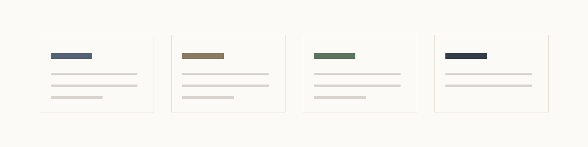

# slide-forge

<p>
  
</p>

**Markdown を書くだけで、統一感のあるスライドに仕上がる。**
配置・余白・配色を毎回悩まなくていいように、レイアウトとデザインをあらかじめ作り込んだ Marp スライド作成基盤です。AIエージェント(Claude Code 等)からも、ブラウザの編集画面からも使えます。

<p>
  
</p>

## これは何をしてくれるのか

- **書くのは内容とレイアウト選択だけ**。`<!-- _class: title -->` のように1行加えるだけで、あとの余白・配色・タイポグラフィは全部テーマ側が決める
- **72種のレイアウトクラス**(表紙・比較・プロセス・数値ハイライト・引用…)と、**3つの配色スキン**(研究発表・ビジネス・輪講/勉強会)を最初から同梱
- **ブラウザで直接編集できるWebUI**。スライド上のテキストをクリックしてそのまま書き換えられ、裏側では常にMarkdownとして保存される(Canva を触ったことがあれば迷わない)
- **崩れたスライドを出さない検証ループ**。要素のはみ出しを機械チェックし、PNG化して目視確認する手順が最初から組み込まれている
- **Claude Code のスキルとして登録可能**。「スライド作って」と頼むだけで、レイアウト選択→生成→検証の一連の流れが自動で回る

## 触ってみる

```bash
git clone https://github.com/taiseee/slide-forge.git
cd slide-forge
npm install

npm run webui -- examples/demo-research.md
# → http://127.0.0.1:5757 が開く
```

サンプルデッキは3本同梱しているので、どれで試してもOKです。

| デッキ | 内容 |
|---|---|
| `examples/demo-research.md` | ゼミ・学会発表向け(研究スキン) |
| `examples/demo-business.md` | 提案・報告向け(ビジネススキン) |
| `examples/demo-lecture.md` | 輪講・社内勉強会向け(輪講スキン) |

## 3つのデザインスキン

同じレイアウト構造のまま、配色だけを差し替えられます。用途に応じて `theme: research` / `business` / `lecture` を切り替えるだけです。

<table>
<tr>
<td width="33%"><br><sub><b>research</b> — グレー/墨色系。ゼミ・学会発表向け</sub></td>
<td width="33%"><br><sub><b>business</b> — グレージュ/ブラウン系。提案・報告向け</sub></td>
<td width="33%"><br><sub><b>lecture</b> — モスグリーン系。輪講・勉強会向け</sub></td>
</tr>
</table>

## 編集WebUI: スライドをそのままクリックして編集する

`npm run webui -- <file.md>` で立ち上がるローカルエディタは、パワポやCanvaのような感覚でMarpスライドを編集できます。

- **直接編集**: スライド上のテキストをクリックすればその場で書き換えられる。太字などの記法は保持される
- **箇条書きの追加・削除**: 編集中に Enter で項目を分割・追加、空の項目で Backspace で削除
- **レイアウトを選んで追加**: 「＋追加 ▾」からレイアウトをプレビューを見ながら選べる。書き方の例が入った状態で挿入される
- **画像の差し替え**: クリックでファイル選択、またはドラッグ&ドロップ
- **スキン切替・書き出し**: ツールバーからテーマを切り替え、PDF・発表用HTMLをワンクリックで書き出せる
- **崩れをその場で検知**: 要素がスライドからはみ出すと即座に一覧に表示される
- **Undo/Redo**、サムネイル並び替え、発表者ノート欄、サイドバー幅のリサイズも標準搭載

キーボードショートカット一覧やインライン編集の詳しい挙動は下記ドキュメントを参照してください。

## レイアウトカタログ(72種)

| 系統 | クラス |
|---|---|
| コア | `title` `title-visual` `agenda` `agenda-grid` `divider` `content` `content-lead` `two-column` `image-right` `image-left` `image-top` `image-bottom` `image-full` `annotated` `comparison` `comparison-3` `pros-cons` `table` `takeaway` `lead` `exec-summary` `summary` `end` `timeline` `timeline-h` `steps` `steps-v` `flow` `cycle` `funnel` `gantt` `roadmap` `columns` `spec` `faq` `matrix` `matrix-3` `venn` `pyramid` `layers` `ranking` `gallery` `before-after` `logos` `stat` `profile` `quote` `code` `checklist` `team` `org` `cards` `scorecard` `transition` `changelog` `contact` `definition` `references` |
| research | `experiment` `math` |
| business | `kpi` `plans` `persona` `tam-sam-som` `tam-sam-som-circle` `case-study` `journey` |
| lecture | `objectives` `quiz` `answer` `code-focus` `misconception` |

各レイアウトの詳しい使い方とMarkdownサンプルは [skill/references/layouts.md](skill/references/layouts.md)、
色・タイポグラフィ・グラフパレット等のデザイン基盤は [docs/DESIGN.md](docs/DESIGN.md) にまとまっています。

## AIエージェントから使う

`skill/SKILL.md` を Claude Code 等のエージェントにスキルとして登録すると、「スライド作成」系の依頼で
自動的にこのワークフロー(レイアウト選択 → 生成 → はみ出しチェック → PNG目視確認)が適用されます。

## 設計思想

- **Marp Markdown が唯一のソース**。HTML/PDF は常にビルド成果物であり、直接編集しない
- **内容と装飾の分離**: 書くのは内容とレイアウト選択だけ。配置・余白・色は全てテーマCSSが決める
- **レイアウトクラスのみ**: ユーティリティクラスや生HTMLでの組み立ては提供しない。表現が足りなければテーマにクラスを追加して育てる
- **検証してから完成**: overflow 機械チェック(Puppeteer)+全スライドPNGの目視確認をワークフローに組み込む

## 構成

```
theme/
  core.css        # 全レイアウトクラス(構造のみ、色はCSS変数)
  research.css    # 研究発表スキン(配色 + experiment/math)
  business.css    # ビジネススキン(配色 + kpi/plans 等)
  lecture.css     # 輪講・勉強会スキン(配色 + objectives/quiz 等)
scripts/
  check-overflow.mjs  # スライドのはみ出しを機械検出
skill/
  SKILL.md            # エージェントスキル(ワークフロー+カタログ索引)
  references/layouts.md  # レイアウト別の完全サンプル
webui/
  server.mjs          # 編集WebUIのローカルサーバ(marp-coreレンダリング+保存API)
  src/                # Canva風エディタ(Vite + React)
examples/
  demo-research.md    # 研究スキンのカタログ兼検証デッキ
  demo-business.md    # ビジネススキンのカタログ兼検証デッキ
  demo-lecture.md     # 輪講・勉強会スキンのデモ(Git内部構造の勉強会デッキ)
docs/
  ROADMAP.md          # 目指す姿・現状・TODO
  DESIGN.md           # デザイン基盤(トークン・書式ルール)
```

CLIから直接ビルド・検証したい場合:

```bash
# ビルド
npx marp --theme-set theme/ --html --allow-local-files examples/demo-research.md -o build/demo.html

# はみ出しチェック
node scripts/check-overflow.mjs build/demo.html

# PNG化(目視確認用)
npx marp --theme-set theme/ --html --allow-local-files --images png examples/demo-research.md -o build/png/demo.png
```

## キーボードショートカット(編集WebUI)

| キー | 動作 |
|---|---|
| `⌘Z` / `⇧⌘Z`(`Ctrl+Z` / `Ctrl+Y`) | 元に戻す / やり直す |
| `Delete` / `Backspace` | 選択中のスライドを削除(テキスト入力中を除く) |
| `⌘D` | スライドを複製 |
| `↑` `↓`(`←` `→`) | スライド選択の移動 |
| `⌘S` | 即時保存(通常は自動保存) |
| `Esc` | インライン編集をキャンセル |
| `Enter`(箇条書き編集中) | カーソル位置で項目を分割して次の項目を追加 |
| `Backspace`(空の項目で) | その項目を削除して前の項目末尾へ |

## License

[MIT](LICENSE)
