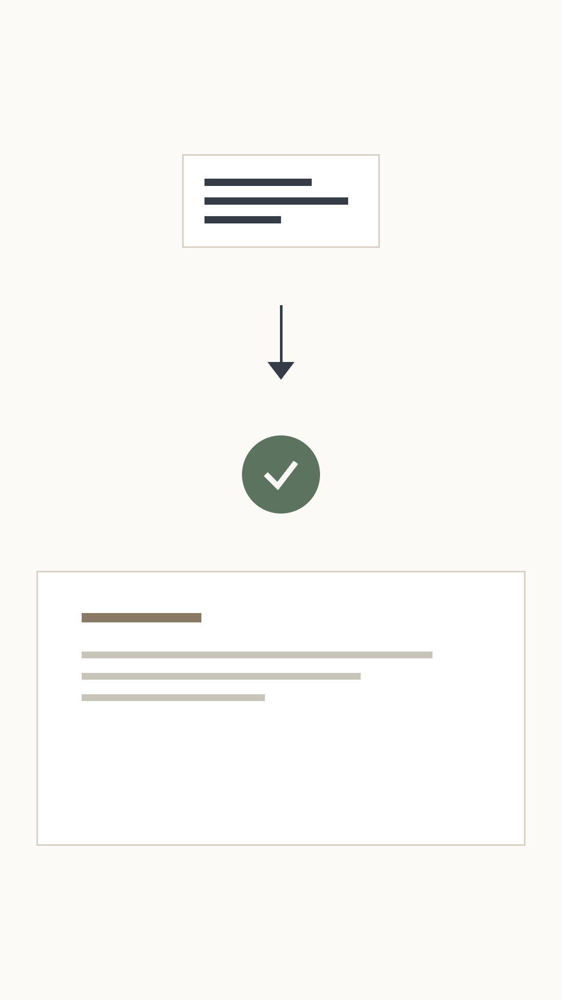
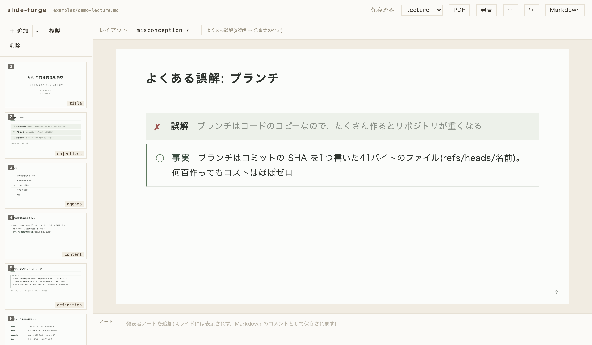
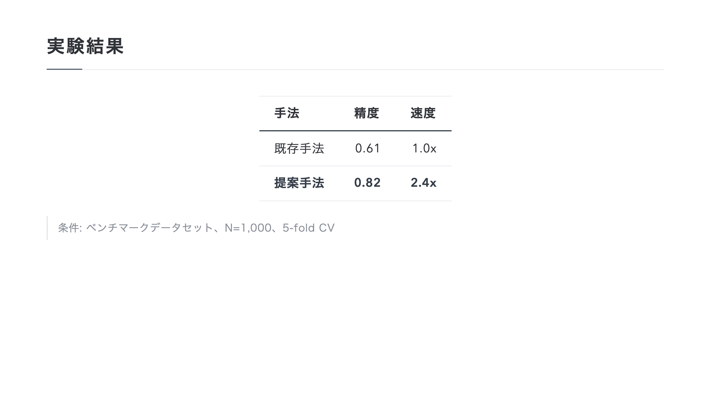
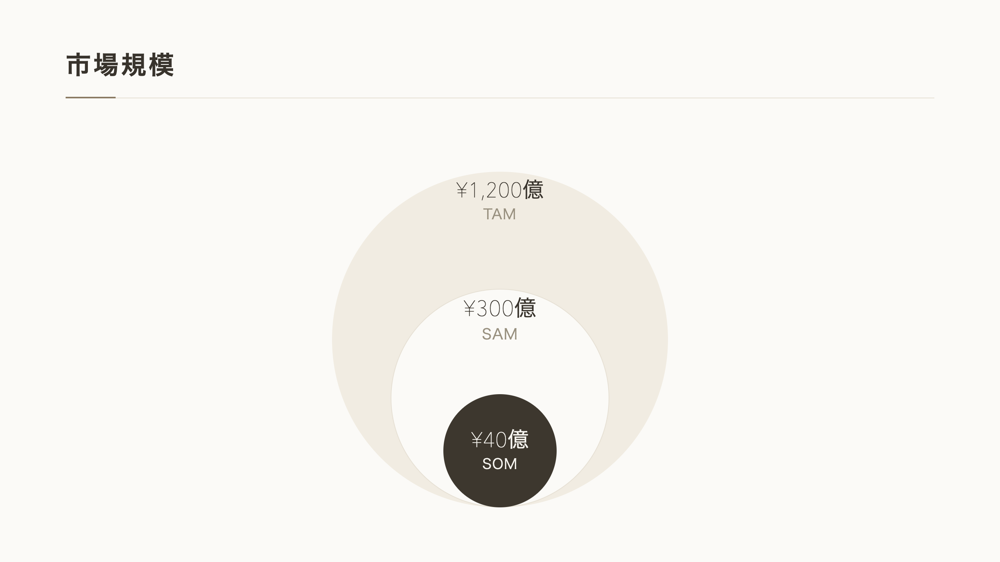
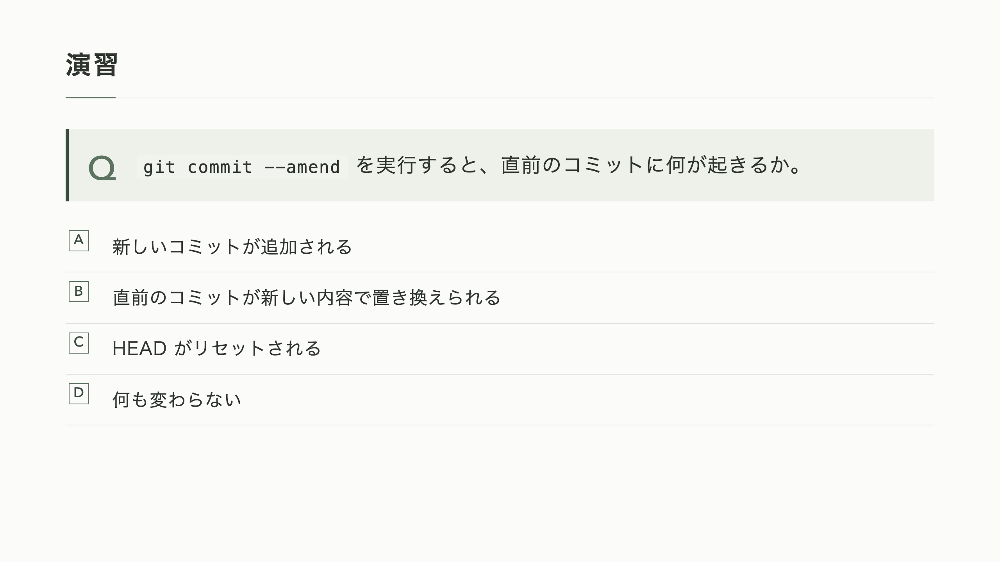
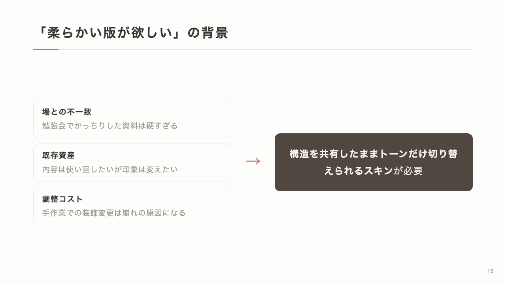

# slide-forge

**AIエージェントファーストのスライド作成基盤。**
「スライド作って」と頼むだけで、エージェント(Claude Code 等)がレイアウトを選び、はみ出しがないか検証までしてから仕上げる。人が直接手を入れたいときのための編集WebUIも同梱している。

- **エージェントに任せると**: `skill/SKILL.md` をスキルとして登録するだけで、「スライド作って」の一言から レイアウト選択 → 生成 → はみ出しチェック → PNG目視確認 が自動で回る
- **エージェントが書くのは内容とレイアウト選択だけ**。`<!-- _class: title -->` のように1行加えるだけで、余白・配色・タイポグラフィは全部テーマ側が決める。毎回バラバラなデザインになったり、生HTMLで無理な組み方をしたりしない
- **108種のレイアウトクラス**と**4つの配色スキン**(研究発表・ビジネス・輪講/勉強会・ソフト)を最初から同梱。エージェントはその中から選ぶだけでいい
- **崩れたスライドのまま出さない**。要素のはみ出しを機械チェックし、PNG化して目視確認するところまでが標準のワークフロー
- **人が直接触りたいときは**、同じMarkdownをブラウザの編集WebUIでそのまま開ける。スライド上のテキストをクリックしてその場で書き換えられる

<p>
  
</p>

## エージェントから使う

[skills](https://skills.sh/) 経由でスキルとして登録するのが最も簡単。`skill/` 配下に
テーマCSS・検証スクリプト・編集WebUIを全部同梱しているので、**このコマンド1つだけで**
CLIやWebUIも含めて動く(リポジトリ本体を別途 clone する必要はない)。

```bash
npx skills add taiseee/slide-forge
```

これで `skill/SKILL.md` が Claude Code 等のエージェントに登録され、「スライド作って」の一言から
レイアウト選択 → 生成 → はみ出しチェック → PNG目視確認が自動で回るようになる。エージェントは
初回だけ `npm install --prefix <スキルの絶対パス>` を実行してから使う(SKILL.md にその手順も書いてある)。

リポジトリ本体を clone して開発・検証したい場合:

```bash
git clone https://github.com/taiseee/slide-forge.git
cd slide-forge/skill
npm install
```

エージェントが書き出したMarkdownは、そのまま下記のCLIやWebUIでも検証・編集できる(`skill/` の中で実行する)。

```bash
cd skill

# ビルド
npx marp --theme-set theme/ --html --allow-local-files ../examples/demo-research.md -o ../build/demo.html

# はみ出しチェック
node scripts/check-overflow.mjs ../build/demo.html

# PNG化(目視確認用)
npx marp --theme-set theme/ --html --allow-local-files --images png ../examples/demo-research.md -o ../build/png/demo.png
```

## 人が直接編集する: WebUI

`npm run webui -- <file.md>` で立ち上がるローカルエディタは、パワーポイントやCanvaのような感覚でMarpスライドを編集できる。エージェントが下書きしたデッキを人が仕上げる、という使い方にも向いている(エージェント自身が起動してURLを提示することもできる)。

```bash
cd slide-forge/skill
npm install
npm run webui -- ../examples/demo-research.md
# → http://127.0.0.1:5757 が開く
```

<p>
  
</p>

- **直接編集**: スライド上のテキストをクリックすればその場で書き換えられる。太字などの記法は保持される
- **箇条書きの追加・削除**: 編集中に Enter で項目を分割・追加、空の項目で Backspace で削除
- **レイアウトを選んで追加**: 「＋追加 ▾」からレイアウトをプレビューを見ながら選べる。書き方の例が入った状態で挿入される
- **画像の差し替え**: クリックでファイル選択、またはドラッグ&ドロップ
- **スキン切替・書き出し**: ツールバーからテーマを切り替え、PDF・発表用HTMLをワンクリックで書き出せる
- **崩れをその場で検知**: 要素がスライドからはみ出すと即座に一覧に表示される
- **Undo/Redo**、サムネイル並び替え、発表者ノート欄、サイドバー幅のリサイズも標準搭載

サンプルデッキは3本同梱しているので、どれで試してもOK。キーボードショートカット一覧は下記を参照。

| デッキ | 内容 |
|---|---|
| `examples/demo-research.md` | ゼミ・学会発表向け(研究スキン) |
| `examples/demo-business.md` | 提案・報告向け(ビジネススキン) |
| `examples/demo-lecture.md` | 輪講・社内勉強会向け(輪講スキン) |
| `examples/demo-soft.md` | カジュアルな発表・社内共有向け(ソフトスキン) |

## 4つのデザインスキン

同じレイアウト構造のまま、配色だけを差し替えられる。用途に応じて `theme: research` / `business` / `lecture` を切り替えるだけ。

<table>
<tr>
<td width="33%"><br><sub><b>research</b> — グレー/墨色系。ゼミ・学会発表向け</sub></td>
<td width="33%"><br><sub><b>business</b> — グレージュ/ブラウン系。提案・報告向け</sub></td>
<td width="33%"><br><sub><b>lecture</b> — モスグリーン系。輪講・勉強会向け</sub></td>
</tr>
<tr>
<td width="33%"><br><sub><b>soft</b> — グレージュ×コーラル・角丸。カジュアルな発表・社内共有向け</sub></td>
<td width="33%"></td>
<td width="33%"></td>
</tr>
</table>

## レイアウトカタログ(108種)

| 系統 | クラス |
|---|---|
| コア | `title` `title-visual` `agenda` `agenda-grid` `objectives` `divider` `content` `content-lead` `two-column` `sidebar` `image-right` `image-left` `image-top` `image-bottom` `image-full` `annotated` `gallery` `photo-grid` `image-cards` `before-after` `logos` `profile` `team` `comparison` `comparison-3` `pros-cons` `transition` `table` `benchmark` `matrix` `matrix-3` `venn` `venn-3` `positioning` `ranking` `scorecard` `steps` `steps-v` `flow` `chain` `io` `cycle` `timeline` `timeline-h` `gantt` `roadmap` `kanban` `funnel` `pyramid` `layers` `org` `tree` `radial` `changelog` `stat` `status` `columns` `cards` `spec` `faq` `checklist` `quote` `quotes` `callout` `code` `lead` `exec-summary` `takeaway` `summary` `contact` `definition` `glossary` `references` `end` `browser` `zoom` `causes` `timeline-photo` `collage` `draft` `confidential` `deprecated` |
| research | `experiment` `math` `hypothesis` `confusion-matrix` `rq` |
| business | `kpi` `plans` `persona` `tam-sam-som` `tam-sam-som-circle` `case-study` `journey` `forces` `bmc` `impact` `okr` `actions` `swot` `pest` `risks` |
| lecture | `quiz` `answer` `code-focus` `misconception` `cheatsheet` `code-compare` |

各レイアウトの詳しい使い方とMarkdownサンプルは [skill/references/layouts.md](skill/references/layouts.md)、
色・タイポグラフィ・グラフパレット等のデザイン基盤は [skill/references/design.md](skill/references/design.md) にまとまっている。

## 設計思想

- **エージェントファースト**: 人が毎回レイアウトや配色を判断しなくてもいいように、エージェントが選ぶのは内容とレイアウトクラスだけにする。判断の余地を減らすほど、エージェントの出力は安定する
- **Marp Markdown が唯一のソース**。HTML/PDF は常にビルド成果物であり、直接編集しない
- **内容と装飾の分離**: 書くのは内容とレイアウト選択だけ。配置・余白・色は全てテーマCSSが決める
- **レイアウトクラスのみ**: ユーティリティクラスや生HTMLでの組み立ては提供しない。表現が足りなければテーマにクラスを追加して育てる
- **検証してから完成**: overflow 機械チェック(Puppeteer)+全スライドPNGの目視確認をワークフローに組み込む

## 構成

`skill/` 一本だけで自己完結している(`npx skills add` ではこの中だけがエージェントにコピーされる)。
リポジトリルートの `examples/` `docs/ROADMAP.md` は slide-forge 自体を開発・拡張するときのもの(スキル単体には含まれない)。

```
skill/
  SKILL.md            # エージェントスキル(ワークフロー+カタログ索引)
  package.json        # このスキル単体で npm install できる npm パッケージ
  references/
    layouts.md        # レイアウト別の完全サンプル
    design.md         # デザイン基盤(トークン・書式ルール)
  theme/
    core.css          # 全レイアウトクラス(構造のみ、色はCSS変数)
    research.css      # 研究発表スキン(配色 + experiment/math/hypothesis)
    business.css      # ビジネススキン(配色 + kpi/plans/forces 等)
    lecture.css       # 輪講・勉強会スキン(配色 + quiz/answer/cheatsheet 等)
    soft.css          # ソフトスキン(グレージュ×コーラルの配色 + 角丸トークン。全クラスの合併)
  scripts/
    check-overflow.mjs  # スライドのはみ出しを機械検出
  webui/
    server.mjs        # 編集WebUIのローカルサーバ(marp-coreレンダリング+保存API)
    src/              # Canva風エディタ(Vite + React)
examples/
  demo-research.md    # 研究スキンのカタログ兼検証デッキ
  demo-business.md    # ビジネススキンのカタログ兼検証デッキ
  demo-lecture.md     # 輪講・勉強会スキンのデモ(Git内部構造の勉強会デッキ)
  demo-soft.md        # ソフトスキンのデモ(角丸デザインの紹介デッキ)
docs/
  ROADMAP.md          # 目指す姿・現状・TODO(リポジトリを担う人向け)
```

## キーボードショートカット(編集WebUI)

| キー | 動作 |
|---|---|
| `⌘Z` / `⇧⌘Z`(`Ctrl+Z` / `Ctrl+Y`) | 元に戻す / やり直す |
| `Delete` / `Backspace` | 選択中のスライドを削除(テキスト入力中を除く) |
| `⌘D` | スライドを複製 |
| `↑` `↓`(`←` `→`) | スライド選択の移動 |
| `⌘S` | 即時保存(通常は自動保存) |
| `Esc` | インライン編集をキャンセル |
| `Enter`(箇条書き編集中) | カーソル位置で項目を分割して次の項目を追加 |
| `Backspace`(空の項目で) | その項目を削除して前の項目末尾へ |

## License

[MIT](LICENSE)
