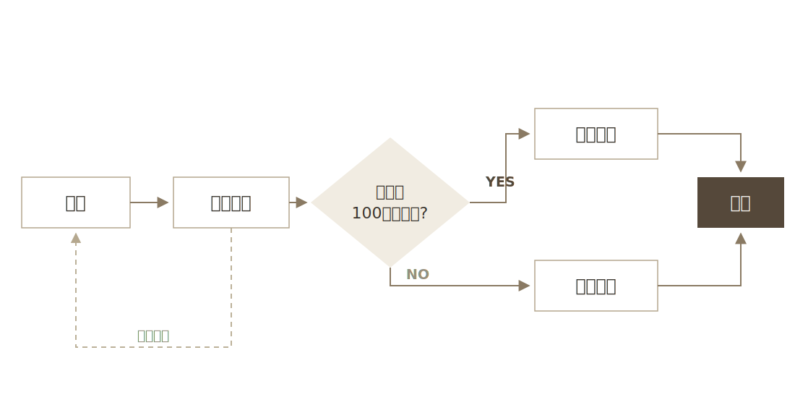
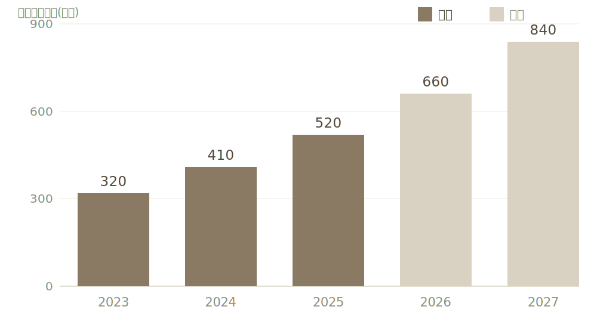

<!-- _class: title -->
<!-- _paginate: false -->

# 新規事業提案: スライド自動生成基盤

社内ドキュメント業務の生産性向上に向けて

事業開発部

2026年7月8日 · 経営会議

---

<!-- _class: agenda -->

# 本日のアジェンダ

1. **事業ハイライト**
2. 課題と提案
3. ロードマップ
4. 投資対効果

---

<!-- _class: agenda-grid -->

# 全体アジェンダ(2列版)

1. **事業ハイライト**
2. 現状の課題
3. 提案内容
4. 導入前後の比較
5. ロードマップ
6. 推進体制
7. 投資対効果
8. まとめ

---

<!-- _class: divider -->

# 1. 事業ハイライト

直近四半期の実績

---

<!-- _class: exec-summary -->
<!-- _header: CONFIDENTIAL -->

# エグゼクティブサマリー

> 資料作成工数をテンプレート+自動生成で1/4に削減し、初年度から1,600万円の純効果を見込む。2026 Q3のパイロット導入承認をお願いしたい。

- **課題** 営業1人あたり週4時間が資料の見た目調整に消えている
- **提案** 全社共通テンプレート+自動検証基盤の導入
- **効果** パイロット実測で作成時間75%削減、品質の全社統一
- **計画** Q3パイロット(30名) → 2027 Q1全社展開(500名)

---

<!-- _class: kpi -->

# 直近四半期の実績

- **120%** 売上成長率(YoY) *前年比 +20pt*
- **3.5万人** 月間アクティブユーザー *目標比 +8%*
- **12社** 新規導入企業 *前年比 +5社*

社内試験導入3部門でのアンケートに基づく集計

---

<!-- _class: ranking -->

# 部門別の資料作成工数(週あたり)

1. **営業部** 4.2時間/人 — デザイン調整が6割を占める
2. **企画部** 3.6時間/人 — 経営会議資料の作り直しが頻発
3. **開発部** 2.1時間/人 — 技術資料のフォーマットが不統一
4. **管理部** 1.4時間/人 — 定型報告が中心

---

<!-- _class: image-top -->

# 利用イメージ

- 書き手はMarkdownで内容だけを書き、テンプレートが見た目を担保する
- ビルドと検証は自動。人は内容のレビューに集中できる

---

<!-- _class: content -->

# 現状の課題

- 資料作成に営業1人あたり週4時間を消費
  - デザイン調整が作業時間の6割を占める
- 部門ごとにフォーマットが乱立し、ブランドが不統一
- **本質**: 内容ではなく見た目に時間が使われている

> 提案: テンプレート+自動生成で「内容だけ考えれば良い」状態を作る

---

<!-- _class: content confidential -->

# 価格改定案(社外秘・承認前)

- 2027年度からエンタープライズプランの価格体系を改定する案
- 既存契約には現行価格を12ヶ月維持する移行措置を設ける
- 取締役会での承認前のため、本ページは社外に共有しない

透かしは `_class: content confidential` のように既存レイアウトに重ねて使う

---

<!-- _class: comparison -->

# 導入前後の比較

## 現状

- 資料作成: 週4時間/人
- フォーマット: 部門ごとに乱立
- 品質: 属人的

## 導入後

- 資料作成: 週1時間/人
- フォーマット: 全社統一
- 品質: テンプレートで担保

---

<!-- _class: comparison-3 -->

# 実現方式の3案比較

## A: 内製開発

- 初期コスト大
- 要件に完全適合
- 保守は自社負担

## B: 本提案(テンプレート基盤)

- 初期コスト小
- 既存資産を活用
- 段階導入が可能

## C: 外部SaaS

- 月額費用が継続
- カスタマイズ制約
- データ持ち出しの懸念

---

<!-- _class: pros-cons -->

# 本提案のメリット・デメリット

## メリット

- 資料作成時間を75%削減
- 全社でブランド品質を統一
- Markdown資産をそのまま活用

## デメリット

- 凝ったビジュアル表現には不向き
- 初期の移行・研修コストが発生
- テンプレート保守の体制が必要

---

<!-- _class: cycle -->

# 運用改善サイクル

- **計画** テンプレートと指標を設計
- **実行** 部門で資料を作成・運用
- **評価** 工数と品質を測定
- **改善** テンプレートへ反映

---

<!-- _class: timeline -->

# 導入ロードマップ

1. **2026 Q3** 営業部門でパイロット導入(30名)
2. **2026 Q4** 効果測定とテンプレート拡充
3. **2027 Q1** 全社展開(500名)
4. **2027 Q2** 社外向け提案資料への適用拡大

---

<!-- _class: timeline-h -->

# 全社展開スケジュール

1. **2026 Q3** パイロット導入。営業部門30名で試験運用と課題抽出
2. **2026 Q4** 効果測定。工数削減とテンプレート利用率を評価
3. **2027 Q1** 全社展開。500名へロールアウトし研修を実施
4. **2027 Q2** 社外適用。提案資料・IR資料へ範囲を拡大

---

<!-- _class: timeline-photo -->

# プロジェクトの歩み

1.  **2025** 社内有志がプロトタイプを開発。デザインの原型が固まる
2.  **2026 上期** 営業部門でパイロット導入。作成時間を60%削減
3.  **2026 下期** 全社展開。テンプレート委員会が発足

---

<!-- _class: steps -->

# 導入プロセス

1. **現状調査** 各部門の資料作成フローと工数を棚卸しする
2. **テンプレート整備** 既存資料を分析し全社共通レイアウトを設計する
3. **試験運用** パイロット部門で1四半期運用し改善を回す
4. **全社展開** 研修とガイドライン配布を経て順次移行する

---

<!-- _class: columns -->

# サービスの特徴

- **内容に集中** 見た目の調整はテンプレートが担い、書き手は内容だけを考えれば良い
- **品質の担保** 全社統一のレイアウトとチェック機構で、誰が作っても崩れない
- **既存資産の活用** Markdownベースなので既存ドキュメントからの移行が容易

---

<!-- _class: spec -->

# サービス概要

- **サービス名** slide-forge
- **提供形態** 社内基盤(オンプレミス)
- **対象部門** 営業・企画・開発・管理
- **入力形式** Markdown(テンプレート選択式)
- **出力形式** HTML / PDF / PNG
- **導入時期** 2026年 Q3(パイロット)

---

<!-- _class: app-intro -->

# 自社サービス紹介

社内3部門で試験運用中の資料作成基盤

## slide-forge

「資料づくりは時間がかかるもの」という常識を変えたい。Markdownで内容を書くだけで、テンプレートが体裁を整え、はみ出し検証まで自動で行う社内基盤です。

- **100種超** のレイアウトを同梱
- **4スキン** を1クリックで切替
- **自動検証** ではみ出しゼロを担保

---

<!-- _class: matrix -->

# 導入判断の整理(SWOT)

## 強み

- 既存Markdown資産をそのまま活用できる
- 品質がテンプレートで担保される

## 弱み

- 凝ったビジュアル表現には向かない

## 機会

- 全社的な業務効率化の機運が高い

## 脅威

- 汎用スライドAIツールの台頭

---

<!-- _class: matrix-3 -->

# リスク評価(影響 × 発生確率)

|  | 確率: 低 | 確率: 中 | 確率: 高 |
|---|---|---|---|
| 影響: 大 | 基盤障害 | **移行の遅延** | — |
| 影響: 中 | 主要人材の離脱 | 研修コスト超過 | **利用率の伸び悩み** |
| 影響: 小 | — | 軽微な表示崩れ | 問い合わせ増加 |

---

<!-- _class: venn-3 -->

# 3C分析

- **自社** Markdown資産と開発文化。テンプレートによる品質担保が強み
- **競合** 汎用スライドAIツール。表現は豊富だが品質が安定しない
- **顧客** 資料作成に時間を取られる事業部門
- **勝ち筋** 品質の安定

---

<!-- _class: forces -->

# 業界構造(5 Forces)

- **業界内の競争** 汎用スライドAIが乱立。差別化は品質の安定性
- **新規参入の脅威** 生成AIの普及で参入障壁は低い
- **売り手の交渉力** LLM基盤への依存が集中リスク
- **買い手の交渉力** 乗り換えコストが低く、価格感度は高い
- **代替品の脅威** 従来のPowerPoint運用・デザイン外注

---

<!-- _class: bmc -->

# ビジネスモデルキャンバス

- **パートナー** LLM基盤ベンダー、導入支援SIer
- **主要活動** テンプレート開発、品質検証、導入研修
- **主要リソース** レイアウト資産、検証パイプライン
- **価値提案** 内容に集中するだけで、一定品質の資料が出てくる
- **顧客との関係** 部門別サポート、四半期レビュー
- **チャネル** 直販、社内ポータル
- **顧客セグメント** 資料作成の多い事業部門・営業組織
- **コスト構造** 開発人件費、LLM利用料
- **収益の流れ** 部門ライセンス(月額)、導入支援費

---

<!-- _class: stat -->

# 75%

資料作成時間の削減率(パイロット実測)

週4時間 → 週1時間、営業部門30名・1四半期の平均

---

<!-- _class: stat-ring p82 -->

# 82%

テンプレートのまま提出できた資料の割合

2026年6月実施、パイロット3部門の
資料127件を集計

---

<!-- _class: faq -->

# よくある質問

## デザインを部門ごとにカスタマイズできますか

共通レイアウトの上に部門別の配色スキンを追加できます。レイアウト自体の改変は品質担保のため受け付けません。

## 既存のPowerPoint資料はどうなりますか

移行ツールで段階的にMarkdown化します。移行期間中は併用を認めます。

## 手書きの図やグラフは使えますか

画像として貼り込めます。図専用のレイアウトを用意しています。

---

<!-- _class: plans -->

# 提供プラン

## ライト

**月5万円** / 部門

- テンプレート利用
- HTML / PDF 出力
- メールサポート

## スタンダード

**月15万円** / 部門

- ライトの全機能
- 部門別配色スキン
- 移行ツール・研修

## エンタープライズ

**個別見積** 全社導入

- スタンダードの全機能
- 専任サポート
- ブランドガイド統合

---

<!-- _class: pyramid -->

# 目指す姿

1. **ビジョン** 内容だけを考えれば良い組織
2. **戦略** テンプレートと自動検証の全社基盤
3. **施策** パイロット導入 → 研修 → 全社展開

---

<!-- _class: pyramid-tri -->

# 資料品質の3層モデル

1. **ブランド** 全社で統一されたトーンと表現
2. **構成** レイアウトクラスによる論理の型
3. **内容** 書き手が集中すべき唯一の領域

---

<!-- _class: logic-tree -->

# 資料作成工数の分解

**週4時間/人** の資料作成工数はどこに消えているか

- **レイアウト調整** 全体の6割を占める最大要因
  - 配置・余白の手直し
  - 崩れの修正
- **内容の作成** 本来時間を使うべき領域
  - 構成の検討
  - 文章・データ整理
- **レビュー・手戻り** 体裁指摘が大半
  - 体裁の指摘対応
  - 版管理の混乱

---

<!-- _class: logos -->

# 導入企業・パートナー

     

社内3部門+協力会社3社で試験運用中

---

<!-- _class: quote -->

# 試験導入部門の声

> 資料の見た目を整える時間がほぼゼロになり、提案の中身を考える時間が倍になった。

営業部 マネージャー(試験導入アンケートより)

---

<!-- _class: quote-photo -->

# 推薦コメント

> レイアウトを考えなくていいというのは、想像以上に大きな変化だった。資料作成が「デザイン作業」から「思考の整理」に変わった。

企画本部長 山田 太郎(全社展開の推進責任者)

---

<!-- _class: table -->

# 投資対効果

| 項目 | 初年度 | 2年目 |
|---|---|---|
| 導入・運用コスト | 800万円 | 300万円 |
| 削減工数(換算) | 2,400万円 | 3,600万円 |
| 純効果 | **+1,600万円** | **+3,300万円** |

削減工数は平均人件費から換算

---

<!-- _class: benchmark -->

# 競合比較

| 評価軸 | 本提案 | ツールA | ツールB |
|---|---|---|---|
| 品質の安定性 | ◎ | △ | ○ |
| Markdown資産の活用 | ◎ | × | △ |
| 導入コスト | ○ | ○ | △ |
| カスタマイズ性 | △ | ◎ | ○ |

社内評価チームによる5段階評価を記号化(2026年6月時点)

---

<!-- _class: impact -->

# 導入効果(パイロット実測)

- **資料1件あたりの作成時間** *4時間* *1時間*
- **体裁の手戻り回数** *3.2回* *0.4回*
- **テンプレート逸脱率** *46%* *2%*

営業部門30名・1四半期の平均。作成時間は下書き開始から配布まで

---

<!-- _class: okr -->

# 今期のOKR

> 全社の資料作成を「内容を書くだけ」の体験に置き換える

1. 対象部門の導入率を80%まで引き上げる *62%*
2. 資料1件あたりの平均作成時間を1時間以内にする *1.3h*
3. テンプレート起因の差し戻しをゼロにする *2件*

---

<!-- _class: status -->

# 全社導入プロジェクトの進捗

- **テンプレート設計** 主要20レイアウトのレビューを完了 *完了*
- **セキュリティ審査** データ取扱いと外部送信範囲を確認中 *対応中*
- **パイロット研修** 営業部30名向けの教材を準備 *準備中*
- **全社展開** パイロットの効果測定後に判断 *未着手*

2026年7月10日時点。毎週金曜日に更新

---

<!-- _class: risks -->

# 導入リスクと対策

- **利用定着の失敗** 研修とテンプレート相談窓口を最初の3ヶ月併走する *中* *大*
- **独自レイアウトの乱立** 追加はレビュー制とし四半期ごとに棚卸しする *高* *中*
- **既存資料の移行コスト** 頻用資料の上位50件のみを優先移行する *中* *中*
- **障害時の業務停止** PDF書き出しを常備し手元編集も可能にする *低* *大*

発生確率・影響度は 2026年6月のリスクアセスメントに基づく

---

<!-- _class: funnel -->

# 商談ファネル(直近四半期)

1. **問い合わせ 120件** 展示会・Web経由
2. **商談化 64件** 初回ヒアリング実施
3. **提案 31件** 個別提案書を提出
4. **受注 12件** 受注率 38.7%

---

<!-- _class: flow -->

# サービス提供フロー

1. **執筆** Markdownで内容だけを書く
2. **生成** テンプレートを適用してビルド
3. **検証** はみ出し・崩れを自動チェック
4. **配布** HTML / PDF で共有

---

<!-- _class: image-full -->

# 発注までの承認フロー

分岐のある業務フロー・承認フローは作図した画像を貼る(パレットはスキンに従う)

---

<!-- _class: positioning -->

# ポジショニングマップ

- **本提案** テンプレート駆動で品質が安定
- **デザイン外注** 高品質だが高コスト・低速
- **旧社内テンプレート** 手作業前提で崩れやすい
- **汎用スライドAIツール** 表現は豊富だが品質が不安定

横軸: カスタマイズ自由度(左=低・右=高) / 縦軸: 品質の安定性(下=低・上=高)

---

<!-- _class: radial -->

# ステークホルダーマップ

全社導入プロジェクト

- **経営層** 投資判断・効果レビュー
- **情シス** 基盤運用・セキュリティ審査
- **事業部門** 日々の資料作成の主体
- **デザイン部門** テンプレート品質の監修
- **導入支援SIer** 研修・移行支援
- **LLM基盤ベンダー** モデル提供・SLA

---

<!-- _class: org -->

# 実施体制

## 全社導入プロジェクト

- **企画チーム** 要件定義・効果測定・経営報告
- **開発チーム** テンプレート整備・検証基盤の運用
- **導入支援チーム** 研修・ガイドライン・問い合わせ対応

---

<!-- _class: team -->

# 推進体制

-  **山田** プロジェクトリード。全体統括と経営層への報告
-  **佐藤** テンプレート設計。全社レイアウトの整備
-  **鈴木** 導入支援。パイロット部門の研修とサポート

---

<!-- _class: checklist -->

# パイロット開始前チェックリスト

- 対象部門と参加メンバー30名の確定
- 既存資料のテンプレート適合性評価
- 効果測定の指標定義(作成時間・利用率)
- 研修資料とガイドラインの準備
- 問い合わせ窓口の設置

---

<!-- _class: takeaway -->

# 資料作成の時間を1/4にし、初年度から1,600万円の純効果を見込む

パイロット導入の承認をお願いしたい

---

<!-- _class: summary -->

# まとめ

- 資料作成の工数をテンプレート+自動生成で1/4に削減
- 全社統一フォーマットでブランド品質を担保
- 2026 Q3 パイロット導入 → 2027 Q1 全社展開

---

<!-- _class: cards -->

# サービスの特徴

-  **テンプレート化** レイアウトクラスを選ぶだけで体裁が揃う
-  **自動検証** はみ出し・崩れを機械チェックしてから納品
-  **編集WebUI** 非エンジニアでもその場でテキストを直接編集
-  **バージョン管理** MarkdownがソースなのでGitで差分管理できる
-  **スキン切替** 研究発表・ビジネス提案を1クリックで切替
-  **画像差し替え** ドラッグ&ドロップで即差し替え

---

<!-- _class: image-cards -->

# 活用シーン

-  **研究発表** 実験結果と考察を、読み手が追いやすい順序で整理
-  **経営会議** KPI・投資対効果・意思決定事項を一枚ずつ明確化
-  **社内勉強会** コード・演習・解答を同じデザイン体系で展開

---

<!-- _class: persona -->

# ペルソナ: 佐藤さん(企画部・35歳)

## 佐藤さん — 企画部 マネージャー

- **ゴール** 提案資料を早く、かつ体裁を崩さず作りたい
- **課題** 毎回ゼロからレイアウトを組み直していて時間がかかる
- **利用シーン** 週次の企画会議・役員向け提案資料
- **重視する点** テンプレートからの逸脱がないこと

---

<!-- _class: image-right -->

# 国内市場の推移と予測

- 市場は年率 **+28%** で拡大し、2027年に840億円へ
- 2026年以降は生成AI連携ツールが成長を牽引する見込み
- 数値グラフは表計算やスクリプトで作図した画像を貼る

出典: ◯◯総研「資料作成支援市場調査 2026」

---

<!-- _class: tam-sam-som -->

# 資料作成支援市場の規模

- **¥1,200億** TAM
- **¥300億** SAM
- **¥40億** SOM

TAM: 国内の資料作成関連市場 / SAM: スライド作成ツール市場 / SOM: 3年以内に獲得を狙う範囲

---

<!-- _class: tam-sam-som-circle -->

# 市場の包含関係(同心円版)

- **¥1,200億** TAM
- **¥300億** SAM
- **¥40億** SOM

TAM: 国内の資料作成関連市場 / SAM: スライド作成ツール市場 / SOM: 3年以内に獲得を狙う範囲

---

<!-- _class: case-study -->

# 導入事例: A社(製造業・従業員3,000名)

営業提案資料の標準化プロジェクト

- **導入前の課題** 部門ごとにフォーマットが乱立し、修正に平均2時間
- **導入後の効果** 資料作成時間を1/4に削減、ブランド逸脱ゼロ

> テンプレートに沿って書くだけで見栄えが揃うので、若手でも
> 迷わず提案書を作れるようになった。

A社 営業企画部 部長

---

<!-- _class: journey -->

# 導入までのカスタマージャーニー

1. **認知** 社内勉強会で紹介 *やや懐疑的*
2. **試用** 1チームで2週間のパイロット *期待*
3. **評価** 作成時間・レビュー指摘数を比較 *納得*
4. **展開** 全社テンプレートとして採用 *満足*

---

<!-- _class: scorecard -->

# 選定基準の評価

- **導入コストの低さ** 追加ライセンス不要 *4.6*
- **既存資産との親和性** 既存Markdown運用と統合しやすい *4.3*
- **カスタマイズ性** レイアウトをテーマ側に追加可能 *4.0*
- **サポート体制** 社内担当者による問い合わせ対応 *3.7*

---

<!-- _class: swot -->

# 導入判断のSWOT分析

- **強み** 既存のMarkdown運用と親和性が高く、追加ライセンス費用が不要
- **弱み** 凝ったビジュアル表現は専用デザインツールに劣る
- **機会** 全社の資料作成時間を年間2,000時間削減できる余地
- **脅威** 部門ごとの独自テンプレートが乱立し標準化が形骸化する恐れ

---

<!-- _class: pest -->

# 外部環境の整理(PEST)

- **政治** 行政のデジタル化推進で文書標準化の要請が強まる
- **経済** 人件費の上昇により資料作成コストの削減圧力が増す
- **社会** リモートワークの定着で資料による非同期共有が前提になる
- **技術** 生成AIの普及で「内容だけ書けば形になる」体験が一般化する

2026年6月時点の外部環境。半期ごとに見直す

---

<!-- _class: quotes -->

# パイロット参加者の声

> レイアウトを考えなくていいので、内容の推敲に時間を使えるようになった。
>
> *— 企画課・提案書担当*

> レビューで体裁の指摘がなくなり、議論が中身に集中するようになった。
>
> *— 情シス・課長*

---

<!-- _class: transition -->

# 資料作成プロセスの変化

## 現状(Before)

- 毎回ゼロからレイアウトを組む
- レビューで体裁の指摘が多い
- 担当者によって品質にばらつき

## 導入後(After)

- レイアウトクラスを選ぶだけ
- 機械チェックで体裁の指摘が激減
- 誰が作っても一定品質

---

<!-- _class: changelog -->

# リリース履歴

## v2.1 — 2026-05

- 編集WebUIにレイアウトピッカーを追加
- 画像のドラッグ&ドロップ差し替えに対応

## v2.0 — 2026-03

- ビジネススキン(business)を追加
- KPIレイアウトの前年差・目標差表示に対応

## v1.0 — 2026-01

- コアレイアウト一式・研究スキンをリリース

---

<!-- _class: chain -->

# 資料作成のバリューチェーン

1. **構成** 目次と主張の骨子を固める
2. **執筆** Markdownで内容を書く
3. **レイアウト** クラスを選んで整える
4. **検証** はみ出しと崩れを機械チェック
5. **レビュー** 関係者の確認と修正
6. **配布** PDF・HTMLで共有

---

<!-- _class: actions -->

# 導入に向けたアクションプラン

1. **パイロットチームの選定** 提案書作成の多い部署から1チーム *企画課* *7/18*
2. **テンプレート研修** レイアウトカタログの使い方を60分で *情シス* *7/25*
3. **既存資産の移行** 頻用スライド10種をMarkdown化 *各部署* *8/8*
4. **効果測定** 作成時間・レビュー指摘数を導入前と比較 *企画課* *8/29*

社内Wikiに進捗ページを開設し、毎週金曜に更新する

---

<!-- _class: kanban -->

# 展開タスクの対応状況

## 未着手

- **英語テンプレート** 海外拠点向けの英文タイポグラフィ調整
- **配布用PDF規則** 外部共有時の機密情報チェック手順

## 対応中

- **テンプレート研修** 第2回を7月末に開催予定
- **既存資産の移行** 頻用スライド10種のうち6種が完了

## 完了

- **パイロット導入** 企画課1チームで2週間実施
- **効果測定の設計** 比較指標と収集方法を確定

---

<!-- _class: contact -->

# お問い合わせ

- **窓口** 情シス企画課
- **Email** contact@example.com
- **社内Wiki** wiki.example.com/slide-forge

---

<!-- _class: end -->
<!-- _paginate: false -->

# ご検討よろしくお願いします

補足資料は Appendix を参照ください
