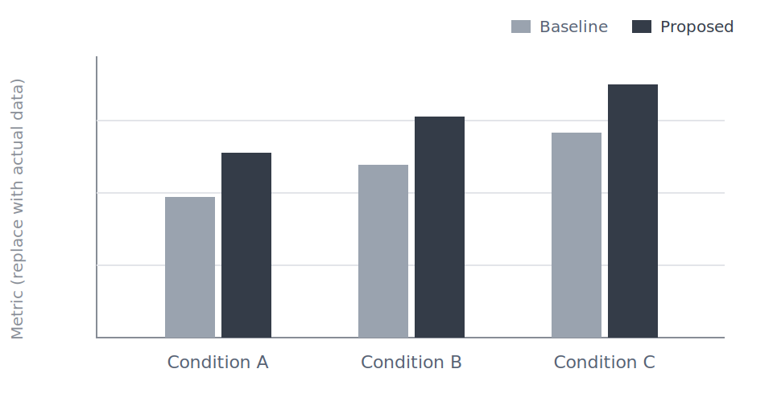
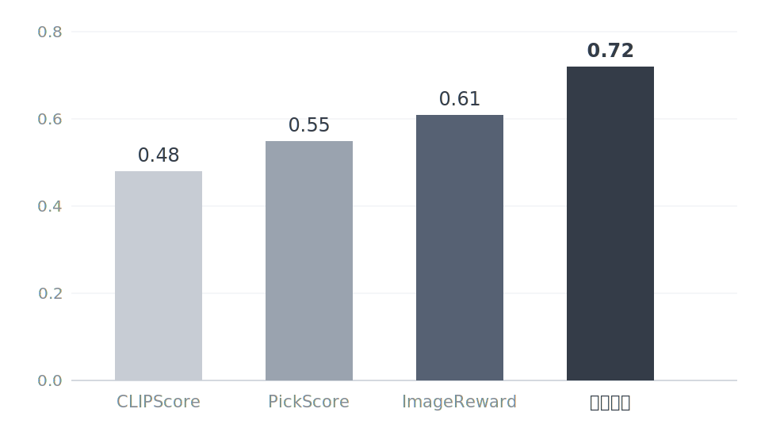
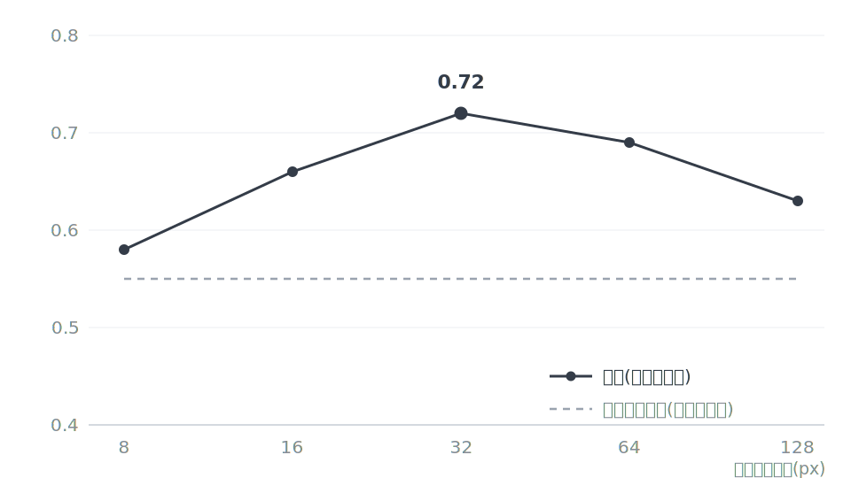
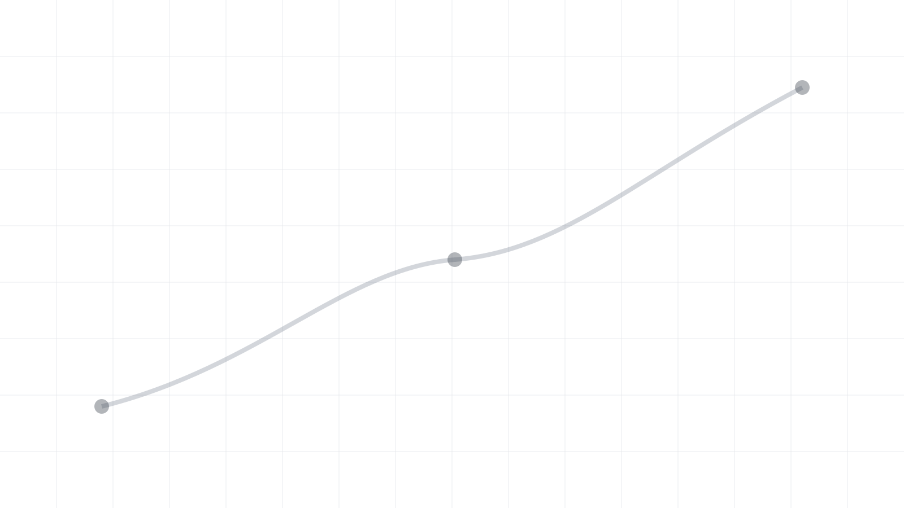

<!-- _class: title -->
<!-- _paginate: false -->

# 局所特徴を考慮した画像生成の自動評価

研究スキンのレイアウトカタログ兼検証デッキ

発表者名

2026年7月8日 · 研究室ゼミ
<!-- テストテスト -->

---

<!-- _class: chart-insight -->

# 主結果: [最も重要な比較]



> **\[+0.0pt\]** \[結果から言えることを、比較条件とともに一文で\]

- [複数データセット／条件での一貫性]
- \[試行数、誤差、有意差、効果量\]

<!--
表の数値を読み上げず、RQへの答えと効果量を述べる。
統計的有意差と実用上の差を区別する。
プレースホルダーSVGは、実データから生成したグラフへ置き換える。
-->

---

<!-- _class: title-visual -->
<!-- _paginate: false -->


# 局所特徴を考慮した画像生成の自動評価

キービジュアル入り表紙の例

発表者名

2026年7月8日 · 研究室ゼミ

---

<!-- _class: agenda -->

# 本日の内容

1. **研究背景と課題**
2. 提案手法
3. 実験と結果
4. まとめと今後の課題

---

<!-- _class: objectives -->

# 本発表のゴール

- **課題の共有** 既存の自動評価が細部の劣化を見逃す構造を理解する
- **提案の骨子** 局所特徴を使った評価指標の設計を説明できる
- **議論** 実験計画の妥当性についてフィードバックを得る

発表 20分 + 質疑 10分

---

<!-- _class: divider -->

# 1. 研究背景と課題

なぜこの問題に取り組むのか

---

<!-- _class: lead -->

# 生成画像の「良さ」を、人手に頼らず測れるか。

本研究が取り組む問い

---

<!-- _class: content -->

# 研究背景

- 画像生成モデルの評価には人手評価が広く使われている
  - 評価コストが高く、再現性に課題がある
- CLIPスコアによる自動評価が注目されている
  - テキストと画像の整合性を埋め込み空間で測定
- **課題**: 既存手法は細部の品質劣化を捉えられない

> 本研究では、局所特徴を考慮した自動評価指標を提案する

---

<!-- _class: two-column -->

# 関連研究の整理

## 自動評価指標

- CLIPスコア: テキスト整合性
- FID: 分布間距離
- LPIPS: 知覚的類似度

## 人手評価

- MOS: 平均オピニオン評価
- ペア比較: 相対品質評価

## 既存手法の限界

- 大域特徴のみで局所劣化を無視
- 評価対象ドメインへの依存
- 人手評価との相関が不十分

---

<!-- _class: rq -->

# Research Question

> 局所的な品質劣化を捉える評価指標は、生成画像の人手評価との相関をどこまで改善できるか

1. **粒度** 局所劣化はどのパッチ分割の粒度で最もよく捉えられるか
2. **汎化** 単一ドメインで設計した指標は他のドメインでも機能するか

RQ1 は実験1・2、RQ2 は実験3 で検証する

---

<!-- _class: hypothesis -->

# 本研究の仮説

1. **局所性** 生成画像の品質劣化は局所領域に集中して現れる
2. **相関** パッチ単位のCLIP類似度は人手評価と相関する
3. **転移** 局所スコアはドメインを跨いでも有効に機能する

各仮説は 4章の実験1〜3 でそれぞれ検証する

---

<!-- _class: sidebar -->

# 実験の前提条件

- 生成モデルは公開チェックポイントを使用し、追加学習は行わない
- プロンプトは MS-COCO キャプションから 1,000 件を抽出
- 評価者は 20 名、各画像を 5 段階で採点

すべての実験は同一シードで 3 回実行し、平均値を報告する

> **補足**
> 評価者間の一致度は Krippendorff の α = 0.72。
> 採点画面の提示順はランダム化し、順序効果を除いた。

---

<!-- _class: image-right -->

# 提案手法の構成

- エンコーダで局所特徴を抽出
- デコーダ側でテキスト条件を融合
- 局所・大域スコアを統合して出力

**ポイント**: 既存のCLIP埋め込みを再利用し、追加学習を最小化


---

<!-- _class: qualitative-grid -->

# 定性結果の比較

| 手法 | 入力A | 入力B | 入力C |
|---|---|---|---|
| 既存手法 |  |  |  |
| **提案手法** |  |  |  |

> 提案手法は細部の構造と一貫性を維持した。

---

<!-- _class: image-left -->

# 局所特徴抽出の詳細

- パッチ単位で特徴マップを分割
- 各パッチとテキストの類似度を計算
- 低スコアパッチを劣化候補として重み付け

これにより細部の品質劣化を明示的に評価できる


---

<!-- _class: image-full -->

# 評価スコアの分布


提案手法は人手評価との相関が単調に向上する

---

<!-- _class: image-left -->

# 主結果: 人手評価との相関

- 提案手法が全ベースラインを上回り **ρ = 0.72** を達成
- 学習型指標(ImageReward)に対しても +0.11 の改善
- 局所スコアの導入が寄与(5章のアブレーションで検証)

**グラフは作図した画像を貼る**(スキンのグラフパレットに従う)



---

<!-- _class: image-full -->

# パッチ粒度の感度分析



相関は 32px で最大となり、粗すぎても細かすぎても低下する

---

<!-- _class: image-bottom -->
<!-- _footer: ◯◯大学大学院 △△研究室 -->

# システム全体像

- 生成画像とプロンプトを入力とし、局所・大域スコアを統合して出力する
- 点線部が本研究で追加した局所評価モジュール



---

<!-- _class: causes -->

# 失敗例とエラー分析

- **データ要因** \[不足・偏り・ノイズ\]
- **モデル要因** \[表現・目的関数・容量\]
- **評価要因** \[指標・アノテーション・閾値\]

[観測された失敗パターン] が **[利用者・結論に与える影響]**

<!--
推測と実験で確認した原因を分ける。
どの追加実験で原因を切り分けられるかを示す。
-->

---

<!-- _class: flow -->

# 提案手法の全体像

1. **入力** [モデルが受け取る情報]
2. **表現** [特徴抽出・前処理]
3. **中核処理** [提案要素と既存要素の関係]
4. **出力** [予測・生成物・スコア]

[既存手法との差分を1行で]

<!--
最初は部品名よりデータの流れを説明する。
複雑な構成は assets/method-overview.svg に置き換え、この順序と対応させる。
-->

---

<!-- _class: comparison -->

# 学習時と推論時

## 学習時

- **入力・教師** [入力と監督信号]
- **最適化** [損失と学習されるパラメータ]
- **追加コスト** [計算量・データ要件]

## 推論時

- **入出力** [実運用で使う情報と返す結果]
- **固定部分** [更新しないモデル・資源]
- **計算量** [速度・メモリ]

<!--
学習時だけ使う情報が推論時に漏れていないかを明示する。
何を学習し、何を固定するのかを曖昧にしない。
-->

---

<!-- _class: comparison -->

# 学習時と推論時

## 学習時

- **入力・教師** [入力と監督信号]
- **最適化** [損失と学習されるパラメータ]
- **追加コスト** [計算量・データ要件]

## 推論時

- **入出力** [実運用で使う情報と返す結果]
- **固定部分** [更新しないモデル・資源]
- **計算量** [速度・メモリ]

<!--
学習時だけ使う情報が推論時に漏れていないかを明示する。
何を学習し、何を固定するのかを曖昧にしない。
-->

---

<!-- _class: status -->

# 前回からの進捗

- **完了** [得られた成果・確定した判断] *完了*
- **進行中** [現在検証していること] *対応中*
- **ブロッカー** [判断や支援が必要な点] *要相談*
- **次回まで** [次の具体的な成果物] *未着手*

更新日: [YYYY-MM-DD]

<!--
作業量ではなく、前回から増えた知識・証拠・判断を中心に説明する。
-->

---

<!-- _class: layers -->

# モデルアーキテクチャの階層

1. **統合層(提案)** 局所・大域スコアの重み付き統合(学習対象はここのみ)
2. **局所評価モジュール** パッチ特徴とテキストの類似度計算
3. **CLIP エンコーダ** 画像・テキストの特徴抽出(凍結)
4. **入力** 生成画像+プロンプト

---

<!-- _class: venn -->

# 提案の位置づけ

- **既存の自動評価** 大域特徴・テキスト整合性・追加学習なし
- **人手評価** 細部の品質・高コスト・再現性に課題
- **提案手法** 両者の橋渡し

---

<!-- _class: qualitative-grid -->

# 定性結果: 成功例と差が出る条件

| 入力・参照 | ベースライン | 提案手法 | 観察 |
|---|---|---|---|
| [例1の画像] | [出力画像] | **\[出力画像\]** | [改善点] |
| [例2の画像] | [出力画像] | **[出力画像]** | [改善点] |
| [例3の画像] | [出力画像] | **[出力画像]** | [残る失敗] |

\[画像は同じ縮尺・切り出し・表示条件で比較\]

<!--
代表例だけでなく、境界例または失敗例を最低1件含める。
画像を assets/ に置き、セルの [画像] を Markdown 画像へ置き換える。
-->

---

<!-- _class: before-after -->

# 評価の改善例

## ベースライン


## 提案手法


同一プロンプトに対するスコアの説明性が向上

---

<!-- _class: gallery -->

# 生成結果の比較

 

左: ベースライン、右: 提案手法(細部の破綻が減少)

---

<!-- _class: photo-grid -->

# 生成サンプル一覧

   

代表的な 4 プロンプトの生成結果(人物ドメイン)

---

<!-- _class: timeline-photo -->

# 研究の歩み

1.  **2025** 局所スコアのプロトタイプを実装
2.  **2026 上期** 3データセットで相関評価を実施
3.  **2026 下期** 閾値較正の自動化と論文化

---

<!-- _class: collage -->

# 定性評価のスナップショット

     

手指・文字・背景テクスチャの代表例(詳細は次ページ)

---

<!-- _class: annotated -->

# 定性結果の注目箇所


1. **手指の構造** ベースラインで最も破綻しやすく、提案手法のスコア低下が人手評価と一致
2. **文字領域** 局所スコアが劣化を検出、大域スコアでは見えない
3. **背景テクスチャ** 両手法とも高スコア。差が出ない領域

---

<!-- _class: zoom -->

# 破綻領域の拡大確認

 

右下: スコアが最も低下したパッチ周辺の拡大

---

<!-- _class: content draft -->

# 追加実験の計画(検討中)

- 動画生成モデルへの拡張評価を 2026年8月に実施予定
- 評価者数を 50 名に増やし信頼区間を再推定する
- ベースラインに最新の学習型指標 2 件を追加する

透かしは `_class: content draft` のように既存レイアウトに重ねて使う

---

<!-- _class: profile -->

# 発表者紹介

## 発表 太郎

- **所属** ◯◯大学大学院 △△研究室(M2)
- **研究テーマ** 画像生成の自動評価
- **経歴** ◯◯大学 工学部卒(2025)
- **連絡先** contact@example.com


---

<!-- _class: comparison -->

# 既存手法との比較

## 既存: CLIPスコア

- 大域特徴のみを使用
- 細部劣化に鈍感
- 追加学習不要

## 提案手法

- 局所+大域特徴を統合
- 細部劣化を明示的に評価
- 追加学習は軽量な統合層のみ

---

<!-- _class: table -->

# 評価データセット

| データセット | 画像数 | ドメイン | 人手評価 |
|---|---|---|---|
| COCO-Eval | 5,000 | 一般物体 | あり |
| DrawBench | 200 | プロンプト網羅 | あり |
| PartiPrompts | 1,600 | 構図・関係 | 一部 |

各データセットで人手評価スコアとの順位相関を測定

---

<!-- _class: experiment -->

# 実験結果: 人手評価との相関

| 手法 | COCO-Eval | DrawBench | PartiPrompts |
|---|---|---|---|
| CLIPスコア | 0.542 | 0.481 | 0.463 |
| FID | 0.315 | — | — |
| LPIPS | 0.428 | 0.402 | 0.391 |
| **提案手法** | **0.687** | **0.634** | **0.612** |

> 条件: Spearman順位相関。生成モデルはSDXL、サンプル数は各データセット全量。太字は最良値。

---

<!-- _class: math -->

# スコアの定式化

局所スコアと大域スコアを重み付き和で統合する:

$$
S(x, t) = \lambda \cdot \frac{1}{N} \sum_{i=1}^{N} w_i \, \mathrm{sim}(f_i(x), g(t)) + (1 - \lambda) \cdot \mathrm{sim}(f(x), g(t))
$$

- $f_i(x)$: パッチ $i$ の局所特徴、$g(t)$: テキスト埋め込み
- $w_i$: 劣化候補パッチへの重み、$\lambda$: 統合係数

---

<!-- _class: code -->

# スコア計算の実装

```python
def slide_forge_score(image, text, patches, lam=0.6):
    local = sum(w * sim(f(p), g(text)) for p, w in patches) / len(patches)
    global_ = sim(f(image), g(text))
    return lam * local + (1 - lam) * global_
```

CLIP埋め込み f, g は既存モデルを再利用し、追加学習は統合係数のみ

---

<!-- _class: quote -->

# 先行研究の指摘

> 既存の自動評価指標は大域的な整合性に偏っており、局所的な品質劣化を捉えられていない。

Hessel et al., EMNLP 2021(意訳)

---

<!-- _class: takeaway -->

# 局所特徴の導入だけで、人手評価との相関は 0.54 → 0.69 に向上する

追加学習は統合層のみ、推論コストは1.2倍に収まる

---

<!-- _class: content-lead -->

# 考察

局所特徴の寄与は劣化タイプに依存し、特に構造破綻で顕著だった。

- 構造破綻(手指・文字)では相関が +0.21 と最も改善
- 色調・スタイルの劣化では既存手法と同等
- **限界**: パッチ粒度が固定のため、微細なテクスチャ劣化は捉えきれない

---

<!-- _class: steps-v -->

# 実験手順

1. **データ準備** 3データセットから生成画像と人手評価を収集
2. **スコア計算** 提案手法と既存4手法でスコアを算出
3. **相関評価** Spearman順位相関で人手評価との一致度を測定
4. **アブレーション** 局所・大域の寄与を分解して検証

---

<!-- _class: gantt -->

# 研究計画

| タスク | 7月 | 8月 | 9月 | 10月 | 11月 | 12月 |
|---|---|---|---|---|---|---|
| 劣化タイプ別の分析 | x | x |  |  |  |  |
| 動画生成への拡張実験 |  | x | x | x |  |  |
| 国内研究会発表 |  |  | x |  |  |  |
| 追加実験・アブレーション |  |  |  | x | x |  |
| 国際会議への投稿 |  |  |  |  | x | x |

バーの期間は暫定。査読結果により調整

---

<!-- _class: roadmap -->

# 研究計画(フェーズ別)

## 分析の深掘り

7月 — 8月

- 劣化タイプ別の相関分析
- パッチ粒度の感度分析

## 対外発表

9月 — 10月

- 国内研究会で発表
- フィードバックを反映した追加実験

## 論文化

11月 — 12月

- アブレーションの拡充
- 国際会議へ投稿

---

<!-- _class: timeline -->

# 今後の予定

1. **7月** 劣化タイプ別の分析を追加
2. **8月** 動画生成への拡張実験
3. **9月** 国内研究会で発表
4. **12月** 国際会議へ投稿

---

<!-- _class: io -->

# 提案手法の入出力

## 入力

- **生成画像** 評価対象(任意解像度)
- **プロンプト** 生成時のテキスト
- **参照領域** 任意。局所指定マスク

## 処理

- **パッチ分割** 32px格子に分割
- **CLIP特徴抽出** パッチ単位で埋め込み
- **集約** 下位10%点の平均

## 出力

- **局所忠実度スコア** 0〜1の実数
- **破綻ヒートマップ** 可視化用

---

<!-- _class: causes -->

# 相関が低下する原因の分析

- **高周波テクスチャ** 草地・毛髪などでパッチ類似度が不安定になる
- **小さな破綻領域** 32px格子より小さい破綻が平均化で埋もれる
- **プロンプトの曖昧さ** 参照テキストが短いと類似度の分散が増える

既存指標が人手評価と乖離する主因は**局所情報の欠落**にある

---

<!-- _class: confusion-matrix -->

# 局所破綻検出の混同行列

|  | 予測: 破綻あり | 予測: 破綻なし |
|---|---|---|
| **実際: 破綻あり** | 412 | 38 |
| **実際: 破綻なし** | 51 | 499 |

> テストセット1,000枚、しきい値は検証セットでF1最大となる値を使用

---

<!-- _class: chart-insight -->

# 主結果: 局所特徴により相関が8.4pt向上


> **+8.4pt** 低品質な局所領域を捉えることで、人手評価との一致度が向上した。

- 3データセットで一貫して改善
- エラーバーは3試行の標準偏差

---

<!-- _class: qualitative-grid -->

# 定性結果: 局所破綻の可視化

| 手法 | 手指領域 | 文字領域 | 背景領域 |
|---|---|---|---|
| 既存手法 |  |  |  |
| **提案手法** |  |  |  |

> 提案手法は、画像全体の印象を保ちながら局所破綻を強く検出する。

---

<!-- _class: summary -->

# まとめ

- 局所特徴を考慮した画像生成の自動評価指標を提案した
  - CLIP埋め込みを再利用し追加学習を最小化
- 3つのデータセットで人手評価との相関が既存手法を上回った
- 今後の課題: 動画生成への拡張、劣化タイプ別の分析

---

<!-- _class: references -->

# 参考文献

1. Radford, A. et al.: Learning Transferable Visual Models From Natural Language Supervision, ICML, 2021.
2. Hessel, J. et al.: CLIPScore: A Reference-free Evaluation Metric for Image Captioning, EMNLP, 2021.
3. Heusel, M. et al.: GANs Trained by a Two Time-Scale Update Rule Converge to a Local Nash Equilibrium, NeurIPS, 2017.
4. Zhang, R. et al.: The Unreasonable Effectiveness of Deep Features as a Perceptual Metric, CVPR, 2018.
5. Saharia, C. et al.: Photorealistic Text-to-Image Diffusion Models with Deep Language Understanding, NeurIPS, 2022.

---

<!-- _class: definition -->

# 局所忠実度スコア(Local Fidelity Score)

> 生成画像とプロンプトが指す局所領域について、パッチ単位のCLIP特徴類似度を
> 画像全体で集約した評価指標。既存の画像全体スコアでは検出できない局所的な
> 破綻(手指・文字領域等)を捉えることを目的とする。

パッチサイズ 32px、集約は下位10%点の平均を用いる

---

<!-- _class: cards -->

# 実装上の工夫点

- **パッチ分割** 重なりありのスライディングウィンドウで局所領域を網羅
- **特徴の再利用** CLIPエンコーダは追加学習せず埋め込みのみ再利用
- **閾値較正** 人手評価との相関が最大になる分位点を検証セットで決定
- **外れ値処理** 極端に低いパッチスコアはクリッピングして安定化
- **バッチ処理** 1画像あたり平均40msで計算可能
- **多言語対応** プロンプトの言語非依存(画像側の特徴のみ使用)

---

<!-- _class: scorecard -->

# 評価指標としての妥当性

- **人手評価との相関** 既存手法比で最も高い *0.81*
- **計算コスト** 追加学習不要で軽量 *4.6*
- **解釈のしやすさ** パッチ単位で破綻箇所を提示できる *4.2*
- **頑健性** 画像サイズ・アスペクト比の変化に強い *3.9*

---

<!-- _class: transition -->

# 評価方法の変化

## 従来(画像全体スコア)

- 画像全体を1つの埋め込みで比較
- 局所的な破綻を平均化して見逃す
- 人手評価との相関が頭打ち

## 提案(局所忠実度スコア)

- パッチ単位で局所的な破綻を検出
- 下位分位点で集約し破綻箇所を反映
- 人手評価との相関が既存手法を上回る

---

<!-- _class: changelog -->

# 手法の改訂履歴

## v1.0 — 2026-02

- パッチ分割による局所スコアの初期実装
- 単純平均での集約

## v1.1 — 2026-04

- 下位分位点による集約に変更(平均より頑健)
- パッチサイズを32pxに調整

## v2.0 — 2026-06

- 閾値較正の自動化(検証セットで分位点を決定)
- 3データセットでの再現性検証を追加

---

<!-- _class: content -->

# 要素モーションの確認


- 1回目: グラフが表示される
- 2回目: 説明が表示される
- 3回目: 結論を確認する

<!--
rich motion の確認用スライド。
発表モードで進むと要素が段階的に表示される。
PDFでは最終状態で表示される。
-->

---

<!-- _class: contact -->

# 連絡先

- **研究室** 九州大学 備瀬研究室
- **Email** contact@example.com
- **リポジトリ** github.com/example/local-fidelity-score

---

<!-- _class: end -->
<!-- _paginate: false -->

# ご清聴ありがとうございました

質疑応答へ

contact@example.com
