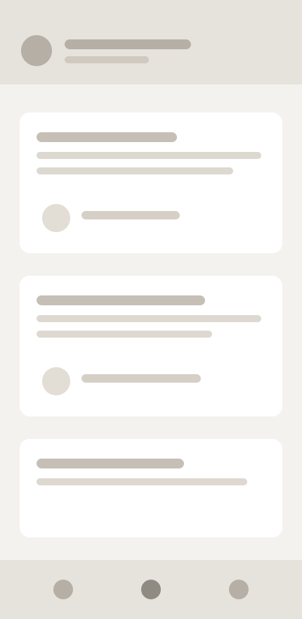
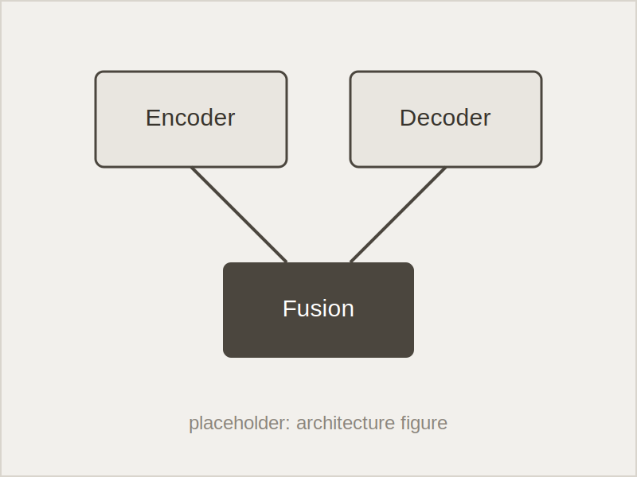
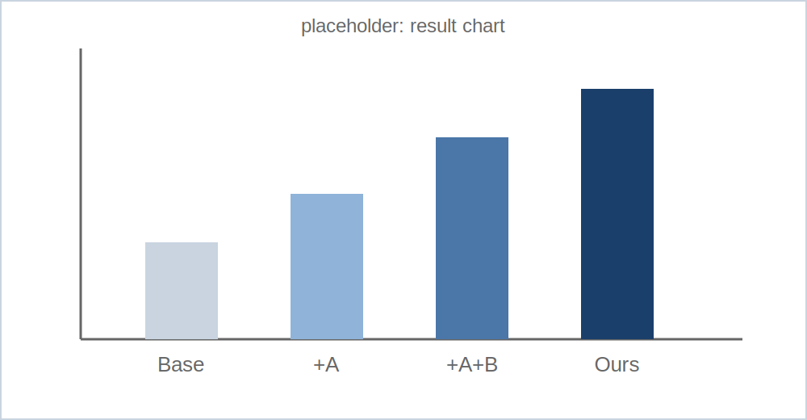
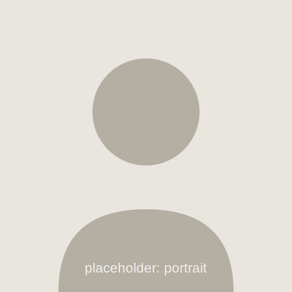

<!-- _class: title -->
<!-- _paginate: false -->

# soft スキン デモ

丸みのある柔らかいデザイン

slide-forge

2026年7月

---

<!-- _class: agenda -->

# 目次

1. **soft スキンとは**
2. 基本レイアウト
3. 図形・プロセス表現
4. 画像とスクリーンショット
5. まとめ

---

<!-- _class: objectives -->

# このデモのゴール

- **確認** パネル・箱・チップが角丸で描画される
- **比較** 他スキン(角丸なし)との印象の違いが分かる
- **選択** 柔らかい印象にしたい発表で soft を選べる

---

<!-- _class: lead -->

# 角丸は「トーン」の選択。構造は他のスキンと全く同じ。

Markdown は1文字も変えずにスキンだけ切り替えられる

---

<!-- _class: content -->

# soft スキンの位置づけ

- research / business / lecture はエディトリアル・ミニマル(角丸なし)
- soft はパネル・箱・チップ・画像を **角丸** で描く柔らかい系統
  - 社内向けの気軽な共有・オンボーディング・コミュニティ発表に
- 配色はラベンダー/スミレグレー系。`--sf-radius` で丸みを一括管理

---

<!-- _class: callout success -->

# 導入はテーマ名の変更だけ

frontmatter の `theme:` を書き換えるだけで既存デッキに適用できる。

> `theme: soft` に変更してビルドし直すと、
> すべてのパネル・箱・チップ・画像が角丸で描画される。

レイアウトクラスの書き方は他スキンと共通

---

<!-- _class: quote -->

# 利用者の声

> 内容はそのままで、資料の印象だけを柔らかくできるのが便利。

社内オンボーディング資料の作成者

---

<!-- _class: comparison -->

# 他スキンとの使い分け

## research / business / lecture

- ヘアライン罫線と直角の面
- 学会・役員会など「かっちり」した場向け
- 装飾を最小限に抑えた editorial minimal

## soft

- 角丸のパネルとピル型チップ
- 勉強会・オンボーディングなど気軽な場向け
- 同じ構造のまま印象だけを柔らかく

---

<!-- _class: matrix -->

# 場面ごとのスキン選択

## フォーマル×社外

- 学会発表・顧客提案は research / business

## フォーマル×社内

- 役員報告・稟議は business

## カジュアル×社外

- コミュニティ登壇・LT は soft / lecture

## カジュアル×社内

- 勉強会・オンボーディングは soft

---

<!-- _class: flow -->

# スキン切替の流れ

1. **選ぶ** 発表の場に合うスキンを決める
2. **書き換え** frontmatter の theme を変更
3. **再ビルド** 検証ループを回して確認

---

<!-- _class: funnel -->

# 資料テンプレートの絞り込み

1. **候補 12案** 社内で使われていたフォーマット
2. **標準 4案** 用途別に統合・整理
3. **採用 1案** slide-forge のスキンとして実装

---

<!-- _class: layers -->

# テーマの構成

1. **スキン(soft.css)** 配色トークン+角丸トークン
2. **コア(core.css)** 全レイアウトクラスの構造
3. **Marp / Marpit** Markdown からのスライド生成

---

<!-- _class: kanban -->

# soft スキンの対応状況

## 完了

- **配色トークン** ラベンダー系で確定
- **角丸トークン** 3段階で定義

## 対応中

- **実発表での検証** 社内勉強会で試用

## 未着手

- **ダーク版の検討** 需要を見て判断

---

<!-- _class: status -->

# リリースまでの進捗

- **デザイントークン** 配色と角丸の定義を完了 *完了*
- **デモデッキ** 主要レイアウトで表示確認 *対応中*
- **利用ガイド** スキン選択の目安を執筆 *未着手*

2026年7月時点

---

<!-- _class: causes -->

# 「柔らかい版が欲しい」の背景

- **場との不一致** 勉強会でかっちりした資料は硬すぎる
- **既存資産** 内容は使い回したいが印象は変えたい
- **調整コスト** 手作業での装飾変更は崩れの原因になる

**構造を共有したままトーンだけ切り替えられるスキン**が必要

---

<!-- _class: browser -->

# 編集WebUIでもそのまま使える

スキン切替ドロップダウンから soft を選ぶだけで反映される

---

<!-- _class: phone -->

# モバイル画面の見せ方

縦長スクリーンショットはスマホ枠に自動で収まる

---

<!-- _class: app-intro pc -->

# 編集環境の紹介

ブラウザだけで完結するスライド編集

## Studio

スライド上のテキストをクリックしてその場で編集。レイアウト切替・画像差し替え・PDF書き出しまで、ブラウザだけで完結する編集環境です。

- **直接編集** クリックした場所をその場で書き換え
- **即時検証** はみ出しをブラウザ内で検出

---

<!-- _class: image-full -->

# 図の描画例

画像も角丸で表示される(作図画像の余白は白か透過にする)

---

<!-- _class: gallery -->

# 画像の横並びも角丸に

 

図・グラフの作図パレットはスキンの配色に従う

---

<!-- _class: collage -->

# 活動スナップ

    

書いた順に定義済みスロットへ散らして配置される(3〜6枚)

---

<!-- _class: takeaway -->

# 内容はそのまま、印象だけを柔らかく。

theme: soft に切り替えるだけ

---

<!-- _class: summary -->

# まとめ

- soft は角丸+ラベンダー系の柔らかいスキン
- 構造・書き方は他スキンと完全に共通で、切替はテーマ名の変更だけ
- カジュアルな発表・社内共有・オンボーディングに向く

---

<!-- _class: end -->
<!-- _paginate: false -->

# ありがとうございました

slide-forge — soft skin
